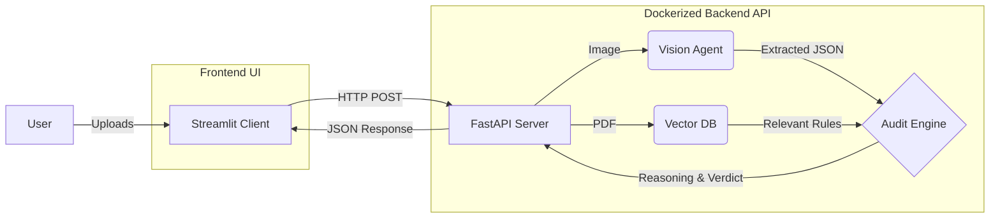

# 🕵️‍♂️ AI-Powered Compliance Audit Agent


[](https://opensource.org/licenses/MIT)

A sophisticated **Multi-Agent System** designed to automate financial auditing, built on a containerized microservice architecture. This application uses **Computer Vision** to extract data from invoices and **Retrieval-Augmented Generation (RAG)** to enforce complex company policies, functioning as an autonomous compliance officer.

---

## 🚀 Key Features

* **🏗️ Decoupled Microservices:** Fully containerized architecture separating the Streamlit UI from the FastAPI backend using Docker Compose.
* **🔌 RESTful API:** Headless AI backend with interactive OpenAPI/Swagger documentation (`/docs`) ready for integration with any web or mobile client.
* **👁️ Multimodal Vision Agent:** Uses **Llama-4-Scout-17b** to natively understand invoice images (OCR-free extraction).
* **🧠 Intelligent Audit Logic:** Uses **Llama-3.3-70b** (via Groq) to perform deep reasoning and detect subtle policy violations.
* **📚 Dynamic Knowledge Base (RAG):** Instantly learns new compliance rules by processing uploaded PDF policy documents via FAISS.

---

## 🏗️ System Architecture

The system is split into an API-driven backend and a lightweight frontend client, connected via an internal Docker network:


---

🛠️ Tech Stack

* **Backend Framework**: FastAPI, Uvicorn

* **Containerization**: Docker, Docker Compose

* **LLM & Vision**: Groq Cloud API (llama-4-scout-17b, llama-3.3-70b)

* **Orchestration**: LangChain (Python)

* **Vector Database**: FAISS (Facebook AI Similarity Search)

* **Embeddings**: HuggingFace (sentence-transformers)

* **Frontend**: Streamlit, Requests

---

***💻 Installation & Local Setup***

Because this project is fully Dockerized, you do not need to manually configure Python virtual environments or install heavy ML libraries on your local machine.

1. **Clone the Repository**

```
git clone [https://github.com/Officialhimanshu710/compliance-audit-agent.git](https://github.com/Officialhimanshu710/compliance-audit-agent.git)
cd compliance-audit-agent
```

2. **Configure API Keys**

Create a ```.env``` file in the root directory and add your Groq API key:
```
GROQ_API_KEY=gsk_your_actual_api_key_here
```

3. **Build and Run with Docker Compose**

This single command will download the necessary environments, install all dependencies, and launch both the API and the UI containers:
```
docker-compose up --build
```

4. **Access the Services**

Frontend UI: Open ```http://localhost:8501``` in your browser.

Backend API Docs (Swagger): Open ```http://localhost:8000/docs``` to test the endpoints directly.

---

***📂 Project Structure***

```
├── main.py              # The Waiter: FastAPI server and REST endpoints
├── app.py               # The UI: Streamlit frontend client
├── agent.py             # The Brain: Handles Vision and Reasoning LLM logic
├── rag_utils.py         # The Memory: Handles PDF processing and FAISS DB
├── Dockerfile           # Blueprint for the backend environment
├── docker-compose.yml   # Multi-container orchestration config
├── requirements.txt     # Python dependencies
└── .env                 # API Secrets (Ignored in Git)
```

---

***🤝 Contribution***

Feel free to fork this repository and submit pull requests. For major changes, please open an issue first to discuss what you would like to change.

## 📝 License

This project is licensed under the MIT License - see the [MIT License](https://opensource.org/licenses/MIT) page for details.
