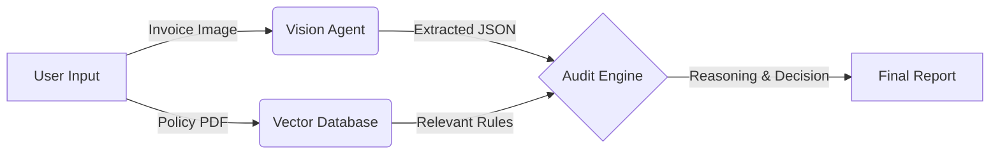

# 🕵️‍♂️ AI-Powered Compliance Audit Agent


A sophisticated **Multi-Agent System** designed to automate financial auditing. This application uses **Computer Vision** to "read" invoices and **Retrieval-Augmented Generation (RAG)** to "understand" complex company policies, functioning as an autonomous compliance officer.

---

## 🚀 Key Features

* **👁️ Multimodal Vision Agent:** Uses **Llama-4-Scout-17b** to natively understand invoice images (OCR-free extraction).
* **🧠 Intelligent Audit Logic:** Uses **Llama-3.3-70b** (via Groq) to perform deep reasoning and detect subtle policy violations.
* **📚 Dynamic Knowledge Base (RAG):** Instantly learns new compliance rules by processing uploaded PDF policy documents.
* **⚡ Real-Time Processing:** leveraging Groq's LPU (Language Processing Unit) for near-instant inference.
* **📸 Dual Input Mode:** Supports both file uploads and direct camera capture for on-the-go auditing.

---

## 🏗️ System Architecture

The system follows a strict **"See -> Remember -> Think"** agentic workflow:


1. Vision Layer: The agent "sees" the invoice image and converts pixels into structured JSON data (Vendor, Date, Line Items).

2. Memory Layer: The Policy PDF is chunked, embedded (using all-MiniLM-L6-v2), and stored in a FAISS Vector Store.

3. Retrieval Layer: The system searches the vector store for specific rules relevant to the invoice items (e.g., searching for "electronics" rules if a laptop is detected).

4. Reasoning Layer: The 70B parameter LLM compares the extracted facts against the retrieved rules to issue a verdict.

---
🛠️ Tech Stack
* LLM & Vision: Groq Cloud API (llama-4-scout-17b, llama-3.3-70b)

* Orchestration: LangChain (Python)

* Vector Database: FAISS (Facebook AI Similarity Search)

* Embeddings: HuggingFace (sentence-transformers)

* Frontend: Streamlit

* Environment Management: Python-Dotenv

---
1. 💻 Installation & Setup
Clone the Repository

```
git clone [https://github.com/Officialhimanshu710/compliance-audit-agent.git](https://github.com/Officialhimanshu710/compliance-audit-agent.git)
cd compliance-audit-agent
```
2. Create a Virtual Environment
```
python -m venv venv
# Windows
venv\Scripts\activate
# Mac/Linux
source venv/bin/activate
```

3. Install Dependencies

```
pip install -r requirements.txt
```

4. Configure API Keys Create a .env file in the root directory and add your Groq API key:

```
GROQ_API_KEY=gsk_your_actual_api_key_here
```

5. Run the Application

```
streamlit run app.py
```
---
🧪 How to Use
1. Upload Policy: In the sidebar, upload a PDF containing your company's travel or expense policy. Click "Process Policy".

2. Upload/Capture Invoice: Use the main interface to upload an image of a receipt or take a photo using your webcam.

3. Run Audit: Click "Run Compliance Check".

4. View Results: The AI will output a decision (Approved/Rejected) along with a specific reason citing the violated rule.

---
📂 Project Structure
```
├── agent.py          # The Brain: Handles Vision and Reasoning logic
├── rag_utils.py      # The Memory: Handles PDF processing and Vector DB
├── app.py            # The Body: Streamlit Frontend Interface
├── requirements.txt  # Project dependencies
└── .env              # API Secrets (Not committed)
```
🤝 Contribution
Feel free to fork this repository and submit pull requests. For major changes, please open an issue first to discuss what you would like to change.

📝 License
## 📝 License
[MIT](https://choosealicense.com/licenses/mit/)
